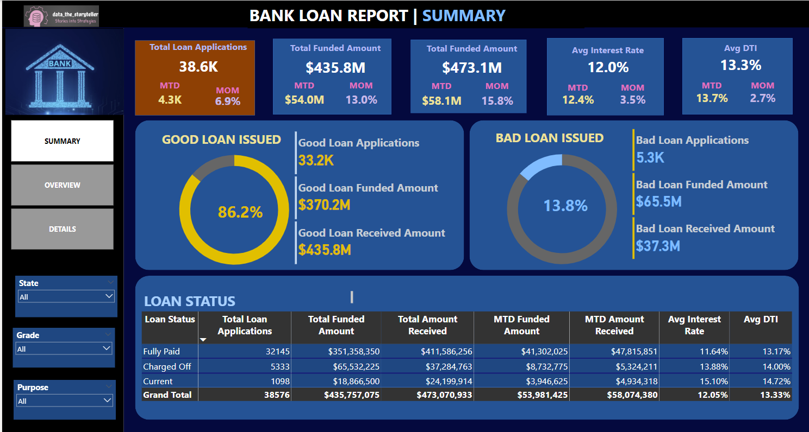
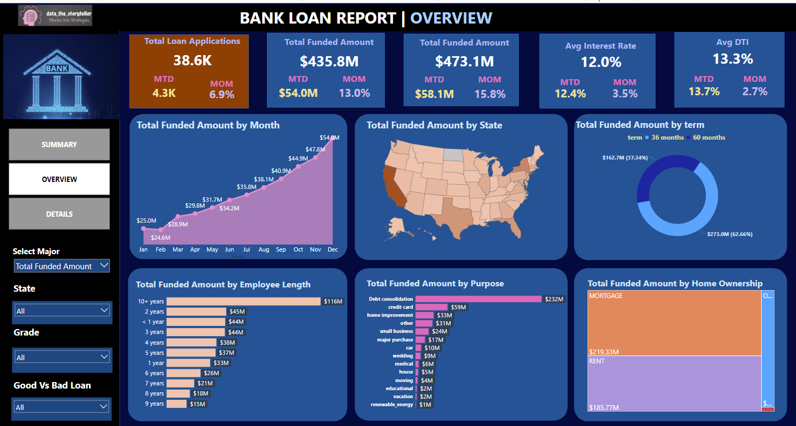
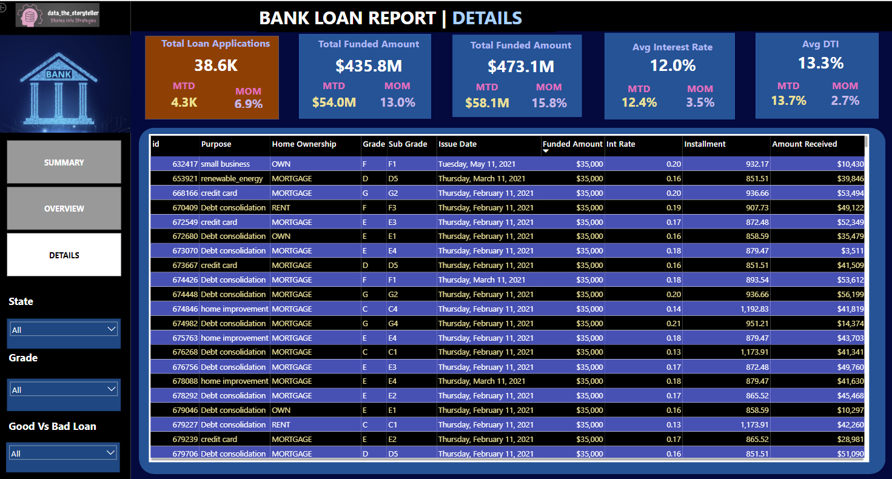

# Bank-Loan-Analytics-Finance-Domain
## Overview
This project conducts an in-depth analysis of bank loan data, utilizing SQL for powerful data querying and manipulation. Enhanced with advanced visualizations and exploration in Power BI, Excel, and Tableau, the analysis aims to uncover actionable insights into loan applications, funding, repayments, and borrower demographics. It examines multiple dimensions, including temporal trends (monthly patterns, loan durations), geographical factors (state-level insights), and categorical elements (loan purposes, homeownership status).

## Objectives
**Conduct a Thorough Evaluation of Loan Portfolio Performance**: Analyze the bank's loan portfolio to pinpoint both strengths and areas needing improvement, providing a clear picture of overall performance.

**Uncover Trends in Loan Applications, Approvals, and Repayment Patterns**: Identify patterns in loan applications, approval rates, and repayment statuses to refine and optimize lending strategies.

**Assess Key Financial Health Indicators**: Examine metrics like Total Funded Amount, Average Interest Rate, and Loan Status to determine the portfolio’s stability and profitability, providing insight into financial resilience.

**Support Data-Driven Strategic Decisions**: Provide insights to enhance the bank’s credit and loan products, ensuring they align with market trends and customer preferences for sustainable growth.

## Data Source
The project is based on a comprehensive LOAN dataset stored in SQL Server, encompassing various aspects of bank loans, including loan amounts, issue dates, interest rates, DTI ratios, and loan statuses.

## Methodology

Our approach to analyzing the bank loan data followed a structured, multi-step process designed to deliver a comprehensive data review and impactful visualizations. Each stage of the methodology is outlined below:

### Data Ingestion and Database Creation

Objective: Build a reliable foundation for efficient data storage and retrieval.

Process: A relational database was constructed using Microsoft SQL Server to house the loan data comprehensively, prioritizing data integrity and ease of access.

### Data Analysis and SQL Queries

Objective: Derive valuable insights and key performance indicators (KPIs).

Process: SQL queries were systematically developed to extract essential KPIs, such as total and monthly loan applications, funded amounts, and average interest rates. This analysis facilitated the detection of critical trends and performance metrics.

### Categorization of Loans

Objective: Segment loans based on repayment performance for targeted risk assessment.

Process: Loans were classified as 'Good' or 'Bad' based on repayment status, offering a clear differentiation between performing and non-performing loans. This classification is essential for effective risk management.

### Temporal and Categorical Analysis

Objective: Analyze loan data across different dimensions and timeframes.

Process: A detailed examination was performed across various factors, including issue month, state, loan term, employment length, loan purpose, and home ownership status. This multi-dimensional analysis provided valuable insights into factors affecting loan performance.

### Visualization

Objective: Convert data findings into actionable visual insights for stakeholder engagement.

Process: Results from SQL queries were visualized using Power BI, Excel, and Tableau, ensuring consistency and a clear graphical presentation of insights. This visualization step was crucial for effectively conveying findings to stakeholders.

# Key Insights and Findings

**Total Loan Applications**: Detailed breakdown of total loan applications, including distinctions between Month-To-Date (MTD) and Previous Month-To-Date (PMTD) applications, providing insights into monthly application trends.

**Total Funded Amount vs. Amounts Received**: Analysis of the bank's liquidity and loan performance, comparing total funded amounts with actual amounts received, highlighting discrepancies and potential financial adjustments.

**Average Interest Rate and DTI (Debt-to-Income Ratio)**: Examination of borrower financial health through average interest rates and DTI ratios, aiding in assessing borrowers' ability to manage debt obligations.

**Loan Categorization**: Segmentation of loans into 'Good' and 'Bad' categories based on repayment status, offering a comprehensive view of the loan portfolio's risk profile and potential credit losses.

**Detailed Breakdowns by Various Factors**: In-depth analysis by loan status, purpose, state, term, and other factors to identify underlying patterns and trends influencing loan performance and customer behavior.

# Tools and Technologies Used

#### SQL Management Server: Used for database management, querying, and data analysis. SQL queries were crucial in extracting key metrics and insights from the loan dataset.

#### Excel: Utilized for data cleaning, processing, and conducting preliminary analyses. Excel provided a platform for validating data integrity and performing initial calculations.

#### Power BI: Employed for data visualization and dashboard creation. Power BI enabled the creation of interactive dashboards that visualize loan portfolio performance and trends.

# Principal Visualizations
## Summary Panel

## Overview Display

 

## Detailed Insights Interface

# Conclusion:
This project has delivered key insights into the bank's loan portfolio, uncovering trends in loan applications, funding, repayment patterns, and borrower demographics. Through detailed data analysis using SQL, Excel, Power BI I have identified actionable insights to support strategic decision-making across the organization.

The visualizations and insights presented in the Power BI and Tableau dashboards provide a comprehensive view of the portfolio’s performance and risk profile. Going forward, these insights will inform efforts to refine loan offerings, strengthen financial health evaluations, and enhance customer satisfaction.

Thank you for exploring this bank loan analysis project. We look forward to leveraging data-driven approaches to propel business growth.